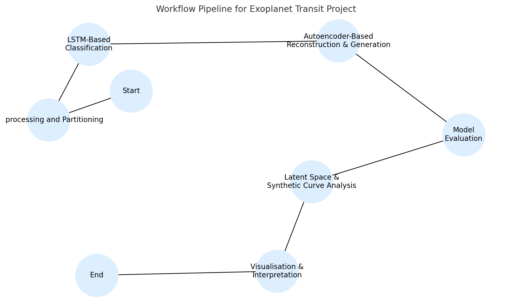

# 🌌 Machine Learning and Smart Systems — Final Project  
## Exoplanet Transit Detection and Generation using LSTM and Autoencoders

This repository contains the final project for the course **Machine Learning and Smart Systems**.  
The goal of the project is to **detect and generate exoplanet transit signals** using deep learning architectures such as **LSTM** and **Autoencoders**.

📓 [Research Log](RESEARCH_LOG.md)

---

### 🔒 Repository Access  
This repository is **public for reference only**.  
To request access to the full code or report, please contact:

**Ilnaza Saifutdinova**  
📧 [ilnazasaifutdinova@gmail.com](mailto:ilnazasaifutdinova@gmail.com)

Unauthorized copying, redistribution, or reuse of any part of the code or report is **strictly prohibited**.

---

### 📜 License  
This repository is licensed under the  
**Creative Commons Attribution-NonCommercial-NoDerivatives 4.0 International License**.  
You may **view and share** the content, but **commercial use, redistribution, and modifications** are **not allowed**.  
Full terms: [CC BY-NC-ND 4.0](https://creativecommons.org/licenses/by-nc-nd/4.0/)

---

### 🧭 Workflow Diagram

